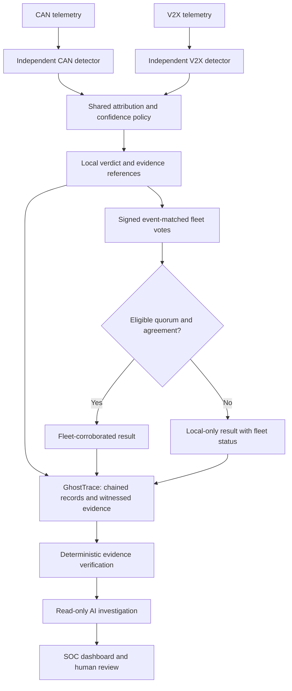

# CAPSTONE — VerdictTrace

**VerdictTrace- Tamper-Evident, Byzantine-Robust Cross-Layer Drift Attribution for Connected Vehicle Fleets**

PES University · CSE · Batch 51 · Guide: **Prof. Saravanaraj S**

VerdictTrace is a proposed detection, attribution and forensic-evidence system for connected vehicle fleets. It investigates whether independent CAN and V2X analysis, event-matched fleet corroboration and witnessed evidence can improve the distinction between benign changes and attacks.

**Status: Phase 1 / Review 1 proposal.** This repository contains the presentation, literature evidence and design plan. The detector, fleet protocol, GhostTrace service, AI investigator, dashboard and datasets have not yet been implemented or experimentally validated. Document-generation code is included; it is not a security-system prototype.

## Start here

| Material | Contents |
|---|---|
| [Review 1 presentation](docs/presentation/VerdictTrace_Phase1_Review1_Final.pptx) | 12 editable slides, diagrams and speaker notes |
| [Research evidence guide](docs/research/VerdictTrace_Research_Gap_Evidence.pdf) | 13 papers, contextual summaries, highlighted short excerpts, gaps, proposed methods and source links |
| [Project proposal](docs/proposal.md) | Problem, scope, planned contributions and use cases |
| [Architecture](docs/architecture.md) | Independent detectors, shared attribution, fleet corroboration, GhostTrace and bounded AI |
| [CAN + V2X integration clarification](docs/can-v2x-integration.md) | Prior integration work and the difference between feature fusion and shared attribution |
| [Evaluation plan](docs/evaluation-plan.md) | Baselines, scenario labels, ablations and success measures |
| [Feasibility and roadmap](docs/feasibility-and-roadmap.md) | INR 20,000 planning ceiling, available hardware and staged milestones |
| [Literature index](research/README.md) | Original-paper links and evidence status, including one later comparison paper |
| [Presentation text and notes](docs/presentation-notes.md) | Searchable text snapshot of the deck |

The presentation records the earlier Review 1 proposal. The expanded research guide and integration clarification contain later literature analysis. The additional 2026 dual-domain IDS reference is documented separately; it is not included in the 13-paper PDF.

## Proposed architecture



Cross-layer correlation modifies confidence; it does not independently establish an attack or clear a strong single-layer alert. The AI investigator is downstream of canonical verdicts and evidence verification. It has no authority to control a vehicle or rewrite those records.

## Research positioning

CAN and V2X integration already appears in published work. VerdictTrace does not claim to be the first combined system. Its proposed research contribution must be established through cause-labelled experiments, explicit insufficient-quorum behaviour, evidence preservation under outages and an evaluated, isolated investigation agent.

## Team

| SRN | Student |
|---|---|
| PES2UG24CS154 | Dhanush Sai Suprapadha |
| PES2UG24CS173 | Gurubelli Yekambar Eshwar Rao |
| PES2UG24CS680 | Shreya R D |
| PES2UG24CS675 | Amruta Karoshi |

## Rebuild the research PDF

The editable PowerPoint can be opened directly. To regenerate the research PDF from its structured content:

```bash
python3 -m venv .venv
source .venv/bin/activate
python -m pip install -r scripts/requirements.txt
python scripts/build_research_guide.py
```

The script overwrites the PDF under `docs/research/` and writes layout metadata under the ignored `build/` directory. Review the rendered PDF after changing content. The edition date is part of the document source.

## Reference materials and rights

[Original supplied files](references/README.md) are retained as background. They may contain earlier scope or terminology. Third-party research papers are linked rather than redistributed as full-text files. See [RIGHTS.md](RIGHTS.md).
